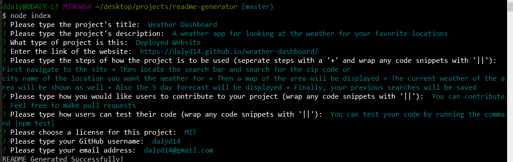

# ReadMe Generator
## Table of Contents
- [ReadMe Generator](#readme-generator)
  - [Table of Contents](#table-of-contents)
  - [Project Description](#project-description)
  - [Installation](#installation)
  - [Usage](#usage)
  - [Contributing](#contributing)
  - [Questions](#questions)

## Project Description
This Node.js app will generate a professional README automatically.

## Installation
1. This is a Node.js application: please make sure you have [node downloaded](https://nodejs.org/en/download/)
2. Create a local repository and [clone](https://docs.github.com/en/free-pro-team@latest/github/creating-cloning-and-archiving-repositories/cloning-a-repository) this GitHub repository to it.
3. Navigate to the folder in your terminal
4. Run the following command to install the required dependencies 
```
npm i
```
5. Type in 
```
node index
```
6. If there is an error, please make sure you did steps 1 and 2 correctly
## Usage
1. Once you are in the folder, run this from your terminal 
```
node index
```
2. Answer the questions that will pop up regarding your project
3. When answering the install and usage questions, seperate the steps with a '+' plus sign
4. When answering other questions, you can wrap code snippets with '||'. i.e. '|npm install|'
5. Once you are finished answering the questions the ReadMe will be generated
6. You can locate the new file in the "dist" folder
7. Make any necessary changes need
8. Remember to add any pictures or links!

## Contributing
Please feel free to add to this project. You can clone/fork the repository and make any pull requests you would like.

## Questions
* Please visit my [GitHub Profile](https://github.com/dalyd14)
* If you have any questions regarding this project, please email me at [dalyd14@gmail.com](mailto:dalyd14@gmail.com)